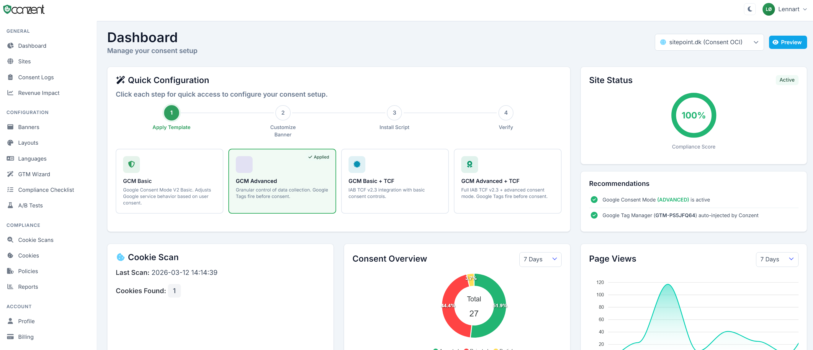
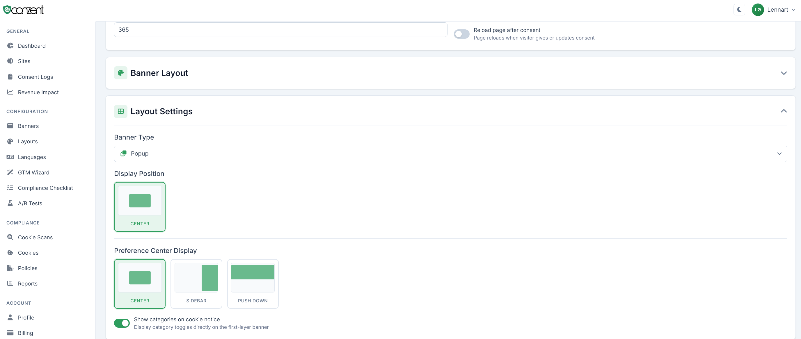
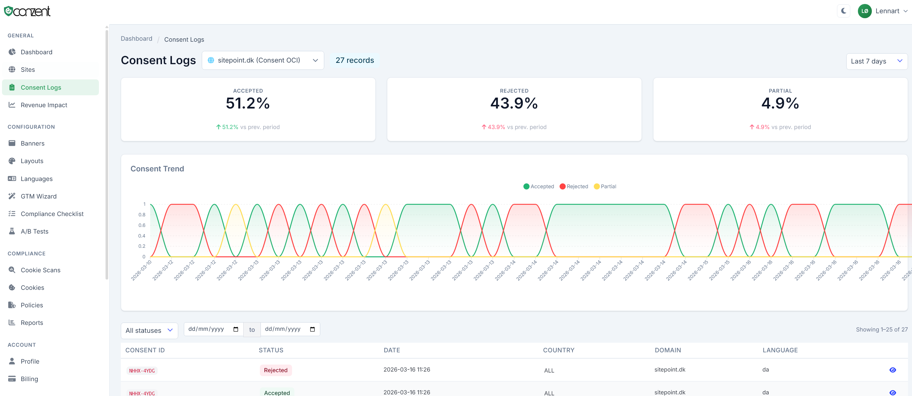
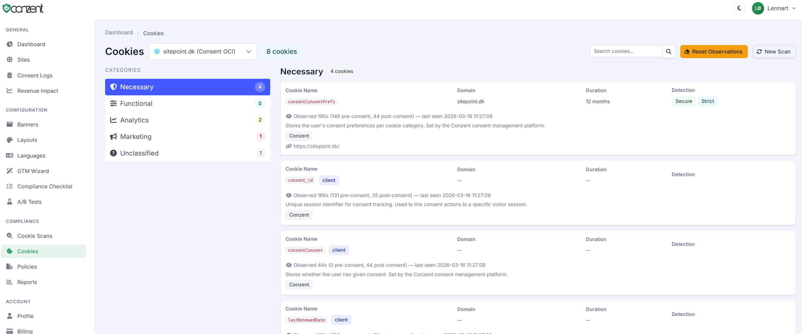
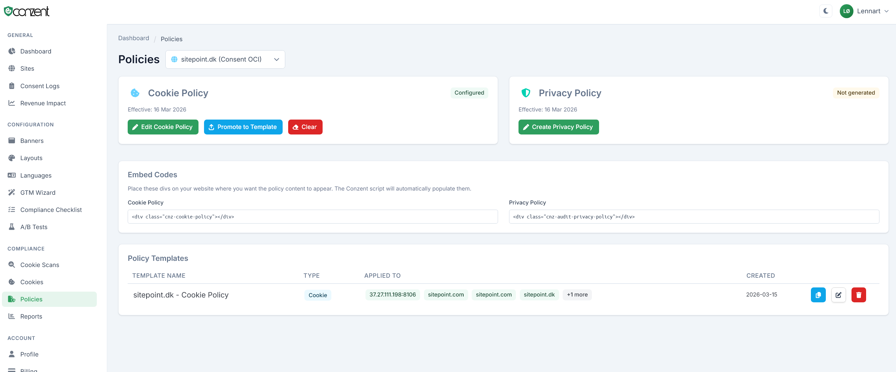

<p align="center">
  
</p>

<h1 align="center">Conzent OCI</h1>

<p align="center">
  <strong>Open Consent Infrastructure — the open-source, self-hosted core of the Conzent Consent Management Platform.</strong>
</p>

<p align="center">
  <a href="https://getconzent.com">Website</a> &middot;
  <a href="https://getconzent.com/docs/">Documentation</a> &middot;
  <a href="https://github.com/conzent-net/oci/issues">Issues</a> &middot;
  <a href="https://getconzent.com/license/">License</a> &middot;
  <a href="https://www.reddit.com/r/consent_cmp/">Reddit - Join the CMP subreddit</a>
</p>

<p align="center">
  <a href="LICENSE.md"></a>
</p>

---

Conzent OCI is a production-grade, **open-source** cookie consent management platform — the freely licensed core of Conzent, released under the Apache License 2.0. Deploy it on your own infrastructure to collect, manage, and report on user consent across all your websites — fully compliant with GDPR, ePrivacy, CCPA, and other privacy regulations.

## Features

- **Cookie Detection & Categorization** — Automatic cookie scanning with categorization (necessary, analytics, marketing, preferences)
- **Customizable Consent Banners** — Multiple layout types (popup, banner, box) with 7 position options, light/dark themes, and full CSS control
- **IAB TCF v2.2 / v2.3 Support** — Register your own CMP ID with IAB Europe and operate a fully certified TCF consent solution
- **Google Consent Mode v2** — Native integration with Google's consent signals for Analytics, Ads, and Tag Manager
- **Multi-Site Management** — Manage consent across unlimited websites from a single dashboard
- **Multi-Language** — Full i18n support for banner content, cookie descriptions, and policies
- **Privacy & Cookie Policy Generation** — Built-in policy wizard that auto-populates from detected cookies
- **Consent Logging & Reporting** — Complete audit trail with date-range filtering, export, and trend visualization
- **Cookie Scanning** — On-demand and scheduled scans to detect cookies, scripts, and tracking technologies
- **Associated Domains** — Share consent state across related domains
- **Compliance Checklists** — Guided setup for GDPR, GCM, CCPA, IAB/TCF, and more
- **Module System** — Extensible architecture for custom integrations

## Screenshots

<p align="center">
  
</p>

<details>
<summary>More screenshots</summary>

|                                                                  |                                                                    |
| ---------------------------------------------------------------- | ------------------------------------------------------------------ |
|  |          |
|    |  |

</details>

## Requirements

- PHP 8.3+
- MariaDB 11+ (or MySQL 8+)
- Redis 7+
- Composer 2+
- Nginx or Apache

## Quick Start

### One-Line Install (recommended)

```bash
curl -sSL https://getconzent.com/install | sh
```

This clones the repository, generates secure credentials, starts all containers, and runs database migrations automatically.

#### Installer Options

| Option                  | Description                                                     |
| ----------------------- | --------------------------------------------------------------- |
| `--dir DIR`             | Installation directory (default: `./conzent`)                   |
| `--branch NAME`         | Git branch to clone (default: `main`)                           |
| `--admin-email EMAIL`   | Admin account email (prompted if omitted)                       |
| `--admin-password PASS` | Admin account password (auto-generated if omitted)              |
| `--domain DOMAIN`       | Public domain, e.g. `consent.example.com` (sets `APP_URL`)      |
| `--update`              | Update an existing installation (preserves database and config) |
| `--no-start`            | Clone and configure only, don't start containers                |
| `--config`              | Show saved admin credentials and app URL                        |
| `--uninstall`           | Stop containers and remove the installation                     |

**Examples:**

```bash
# Install to a custom directory
curl -sSL https://getconzent.com/install | sh -s -- --dir /opt/conzent

# Install against your own domain (see docs/custom-domain.md for TLS)
curl -sSL https://getconzent.com/install | sh -s -- --domain consent.example.com

# Update an existing installation
curl -sSL https://getconzent.com/install | sh -s -- --update

# Fully automated install (CI/scripting)
curl -sSL https://getconzent.com/install | sh -s -- --admin-email admin@example.com --admin-password secret123

# Show saved credentials
curl -sSL https://getconzent.com/install | sh -s -- --config

# Uninstall
curl -sSL https://getconzent.com/install | sh -s -- --uninstall
```

### Using Docker

```bash
git clone https://github.com/conzent-net/oci.git
cd oci
cp .env.example .env
# Edit .env with your database and Redis credentials
docker compose up -d
```

### Manual Installation

```bash
git clone https://github.com/conzent-net/oci.git
cd oci
cp .env.example .env
composer install --no-dev --optimize-autoloader
```

Configure your `.env` file (see [Configuration](#configuration)), then point your web server to the `public/` directory.

### Run Migrations

```bash
php bin/oci migrations:migrate
```

### Verify Installation

Visit your configured `APP_URL` in a browser. You should see the login page. Create your first account and add your website.

## After Install

Running this on a client site? These are the things to do before you go live — each one is a full walkthrough:

| Guide | Covers |
| ----------------------------------------------- | ---------------------------------------------------------------------------------------------------- |
| **[Custom domain & HTTPS](docs/custom-domain.md)** | DNS, TLS termination (Caddy / nginx / Traefik / Cloudflare), and regenerating consent scripts for the new host |
| **[Credentials & rotation](docs/credentials.md)** | Every generated secret, where it lives, how to rotate it — and how to recover a lost admin password |
| **[Backup & restore](docs/backup-restore.md)**  | What actually holds your data, `scripts/backup.sh`, cron scheduling, and a restore drill              |
| **[Upgrading](docs/upgrading.md)**              | What `--update` preserves and what it resets, plus how to customise so changes survive                |
| **[Cookie scanning](docs/scanning.md)**         | Scanner health, callback configuration, tuning, and adding remote scanners                            |

Start with the [documentation index](docs/README.md), which includes a 10-minute production checklist.

```bash
# Back up before every upgrade
bash scripts/backup.sh --keep 14

# Locked out with no SMTP configured? Reset from the host
docker compose exec app php bin/oci user:password --email=you@example.com
```

## Configuration

Copy `.env.example` to `.env` and configure the following sections:

| Section            | Key Variables                                  | Description                                             |
| ------------------ | ---------------------------------------------- | ------------------------------------------------------- |
| **Application**    | `APP_ENV`, `APP_URL`, `APP_SECRET`             | Environment, URL, and encryption secret                 |
| **Database**       | `DB_HOST`, `DB_NAME`, `DB_USER`, `DB_PASSWORD` | MariaDB/MySQL connection                                |
| **Redis**          | `REDIS_HOST`, `REDIS_PORT`                     | Cache, sessions, and queue backend                      |
| **Email**          | `MAIL_HOST`, `MAIL_PORT`, `MAIL_FROM_ADDRESS`  | SMTP for notifications and password resets              |
| **IAB TCF**        | `CMP_ID`                                       | Your registered IAB CMP ID (leave empty to disable TCF) |
| **Google OAuth**   | `GOOGLE_CLIENT_ID`, `GOOGLE_CLIENT_SECRET`     | "Sign in with Google" and GTM integration               |
| **CDN**            | `CDN_URL`                                      | Optional CDN prefix for consent scripts                 |
| **Cloudflare**     | `CLOUDFLARE_ZONE_ID`, `CLOUDFLARE_API_TOKEN`   | Edge cache purge on script regeneration                 |
| **Scanning**       | `SCAN_QUEUE_NAME`, `SCAN_TIMEOUT`              | Cookie scanning configuration                           |
| **AI Translation** | `OPENROUTER_API_KEY`                           | Auto-translate banner content via AI                    |

See `.env.example` for all available options with inline documentation.

## Architecture

Conzent OCI is built on a modern PHP stack with no framework dependencies:

- **PHP 8.3+** with PSR-4 autoloading, PSR-7 HTTP messages, PSR-11 DI container
- **Doctrine DBAL** for database access (query builder, no ORM)
- **Twig** for server-side templates
- **Alpine.js + htmx** for reactive UI without heavy JavaScript
- **Bulma CSS** for responsive layouts
- **Redis** for caching, sessions, and job queues
- **FastRoute** for HTTP routing

### Domain Structure

The codebase is organized into 12 domain boundaries:

| Domain           | Responsibility                                       |
| ---------------- | ---------------------------------------------------- |
| **Identity**     | Users, authentication, sessions, API keys            |
| **Site**         | Website management, domains, script generation       |
| **Cookie**       | Cookie detection, categorization, reference database |
| **Consent**      | Consent collection, logging, reporting               |
| **Banner**       | Banner configuration, content, layouts, translations |
| **Policy**       | Privacy/cookie policy generation & templates         |
| **Compliance**   | IAB TCF v2.2/v2.3, Google Consent Mode v2            |
| **Scanning**     | Scan orchestration, scheduling, results              |
| **Dashboard**    | Site overview, consent stats, recommendations        |
| **Notification** | Email and in-app notifications                       |
| **Report**       | Consent reports and scheduled exports                |
| **Shared**       | Cross-domain DTOs, events, services                  |

### Module System

Conzent OCI supports optional modules in `src/Modules/` for extended functionality. The core application runs fully without any modules. Modules are auto-discovered at boot time and can add routes, services, templates, and menu items.

## CLI Commands

```bash
php bin/oci health                  # Health check
php bin/oci migrations:migrate      # Run database migrations
php bin/oci cache:clear             # Clear all caches
php bin/oci queue:work              # Process background jobs
php bin/oci schedule:run            # Run scheduled tasks
php bin/oci scripts:regenerate      # Regenerate all consent scripts (run after changing APP_URL)
php bin/oci user:password --email=  # Reset a password and sign out that user's sessions
php bin/oci scanner:register        # Register/update a scan server
php bin/oci scanner:health          # Ping registered scan servers
```

Host-side helpers (run from the install directory, not inside the container):

```bash
bash scripts/backup.sh --keep 14                 # Create a restorable archive
bash scripts/restore.sh ARCHIVE.tar.gz --yes     # Restore one
bash scripts/install.sh --update                 # Update to the latest release
```

## Web Server Configuration

### Nginx

```nginx
server {
    listen 80;
    server_name your-domain.com;
    root /var/www/oci/public;
    index index.php;

    location / {
        try_files $uri $uri/ /index.php$is_args$args;
    }

    location ~ \.php$ {
        fastcgi_pass unix:/var/run/php/php8.3-fpm.sock;
        fastcgi_param SCRIPT_FILENAME $document_root$fastcgi_script_name;
        include fastcgi_params;
    }

    location ~* \.(js|css|png|jpg|jpeg|gif|ico|svg|woff2?)$ {
        expires 30d;
        add_header Cache-Control "public, immutable";
    }
}
```

### Apache

```apache
<VirtualHost *:80>
    ServerName your-domain.com
    DocumentRoot /var/www/oci/public

    <Directory /var/www/oci/public>
        AllowOverride All
        Require all granted
    </Directory>
</VirtualHost>
```

## Adding the Consent Banner to Your Website

After configuring your site and banner in the dashboard, add this script tag to your website's `<head>`:

```html
<script
  src="https://your-oci-domain.com/c/consent.js"
  data-key="YOUR_SITE_KEY"
></script>
```

The consent script is lightweight, non-blocking, and handles all cookie consent UI, storage, and reporting automatically.

## Cookie Scanning

Conzent OCI includes a built-in cookie scanning service that detects cookies, scripts, and tracking technologies on your websites. The scanner runs headless Chromium via Puppeteer and communicates with the main app over HTTP. **No additional installation or configuration is required** — the scanner is included in both the one-liner install and Docker Compose setup, and works out of the box.

### How It Works

1. You trigger a scan from the dashboard (or schedule one)
2. The app queues the scan and dispatches it to a scanner server
3. The scanner visits your site with headless Chromium, collecting cookies, localStorage, and network beacons
4. Results are sent back to the app via webhook and stored in the database
5. Detected cookies are auto-categorized (necessary, analytics, marketing, functional) using a global reference database and pattern matching

### What's Included

The default Docker Compose stack runs these scanning-related services automatically:

| Service         | Purpose                                                       |
| --------------- | ------------------------------------------------------------- |
| `scanner`       | Headless Chromium scanning server (internal, port 8300)       |
| `worker`        | Processes scan jobs from the Redis queue                      |
| `scheduler`     | Triggers scheduled and recurring scans                        |
| `beacon-worker` | Processes client-side beacon data in batches                  |

No external dependencies — Chromium, Node.js, and all libraries are bundled in the Docker image.

The scanner has **no published host port**: the app reaches it over the Compose network at `http://scanner:8300`. The installer registers it automatically. If you ever need to re-register it (or point the app at a different scanner), run:

```bash
docker compose exec app php bin/oci scanner:register
docker compose exec app php bin/oci scanner:health
```

See [docs/scanning.md](docs/scanning.md) for details.

### Scanner API

The scanner server exposes these endpoints (authenticated via `X-Api-Key` header):

| Method | Endpoint         | Description                                                              |
| ------ | ---------------- | ------------------------------------------------------------------------ |
| `GET`  | `/health`        | Health check (no auth required) — returns status, active jobs, uptime    |
| `POST` | `/scan`          | Scan a single URL synchronously — returns cookies, localStorage, beacons |
| `POST` | `/scan/batch`    | Scan multiple URLs asynchronously — returns a job ID (202 Accepted)      |
| `GET`  | `/status/:jobId` | Check batch job progress — returns completed/failed counts and results   |

**Single scan request:**

```json
POST /scan
X-Api-Key: your-scanner-api-key

{
  "url": "https://example.com",
  "options": {
    "waitForNetworkIdle": true,
    "extraWait": 3000
  }
}
```

**Batch scan request (used by the app internally):**

```json
POST /scan/batch
X-Api-Key: your-scanner-api-key

{
  "scan_id": 123,
  "urls": ["https://example.com/", "https://example.com/about"],
  "callback_url": "https://your-oci-domain.com/api/v1/scan-webhook",
  "options": {
    "waitForNetworkIdle": true,
    "extraWait": 3000
  }
}
```

### Deploying Additional Scanners

For faster scans or geographic distribution, deploy standalone scanners on separate servers.

**1. On the new server — one line:**

```bash
curl -sSL https://getconzent.com/install-scanner | sh
```

Installs Docker if missing, fetches only the scanner, generates an API key, starts it, verifies health, and prints the
registration command.

**2. On your Conzent server — paste what it printed:**

```bash
docker compose exec app php bin/oci scanner:register \
  --url=http://<server-ip>:8300 \
  --key=<generated-key> \
  --name="EU Scanner" \
  --region=eu
```

Registration is idempotent (keyed by URL), so it is safe to re-run. Confirm with `docker compose exec app php bin/oci scanner:health` — the scanner then starts receiving jobs automatically.

Options (`--key`, `--port`, `--max`, `--name`, `--uninstall`) and a manual, no-pipe-to-shell alternative are in [docs/scanning.md](docs/scanning.md).

### Scanner Configuration

| Variable          | Default      | Description                                        |
| ----------------- | ------------ | -------------------------------------------------- |
| `SCANNER_API_KEY` | _(required)_ | Shared secret for authenticating with the main app |
| `MAX_CONCURRENT`  | `5`          | Maximum parallel browser sessions per container    |
| `SCAN_TIMEOUT`    | `60000`      | Per-page timeout in milliseconds                   |

### Scaling

To run multiple scanner instances on the same server:

```bash
docker compose -f docker-compose.scanner.yml up -d --scale scanner=3
```

### Health Check

Each scanner exposes a health endpoint at `http://<server>:8300/health`.

### System Requirements (per scanner container)

- **Memory:** 512 MB minimum, 2 GB recommended
- **CPU:** 1+ cores
- **Network:** Outbound HTTPS to scan target websites, inbound HTTP from the main app on port 8300

## IAB TCF Registration

To use IAB TCF features:

1. Register independently with [IAB Europe](https://iabeurope.eu/tcf-for-cmps/) as a CMP
2. Obtain your own CMP ID
3. Set `CMP_ID` in your `.env` file
4. The platform automatically enables TCF v2.3 features

> **Note:** TCF registration is per-operator. Conzent's own CMP ID covers Conzent's service only — it does not transfer with the code. Register your own CMP ID with IAB Europe.

## Contributing

We welcome contributions! Please:

1. Fork the repository
2. Create a feature branch
3. Submit a pull request

For bug reports and feature requests, use [GitHub Issues](https://github.com/conzent-net/oci/issues).

## Cloud Edition

Looking for a managed solution? [Conzent Cloud](https://getconzent.com) offers a fully managed version with additional features not available in the open-source edition:

- **A/B Testing** — Test different banner designs and copy to optimize consent rates
- **Revenue Impact Analysis** — Measure how consent rates affect your ad revenue and analytics data
- **Agency Management** — Multi-tenant agency tools with customer management and commission tracking
- **Managed Billing** — Built-in subscription and payment handling
- **Priority Support** — Dedicated support from the Conzent team

## Branding

Conzent OCI ships with a "Powered by Conzent" link in the consent banner. It is **not** required — you're free to remove or replace it — but if you leave it in place, it helps others discover the project and is genuinely appreciated.

## License

Conzent OCI is open source under the [Apache License 2.0](LICENSE.md).

**You are free to** use, self-host, modify, redistribute, and build on the code — including commercially — with no royalties and no conversion date. Just preserve the copyright and license notices, as Apache 2.0 requires.

**Open core:** this repository is the freely licensed core of Conzent. Advanced cloud capabilities — multi-tenant billing, agency management, A/B testing, and revenue-impact analytics — are part of the [managed cloud service](https://getconzent.com) and are not included here.

**Trademarks & CMP ID:** the Apache 2.0 license does not grant rights to the Conzent name, logos, or our IAB Europe CMP ID. To run a TCF-certified setup, register your own CMP ID with IAB Europe.

See [LICENSE.md](LICENSE.md) for the full text and [NOTICE](NOTICE) for attribution.

---

<p align="center">
  Built by <a href="https://getconzent.com">Conzent ApS</a>
</p>
